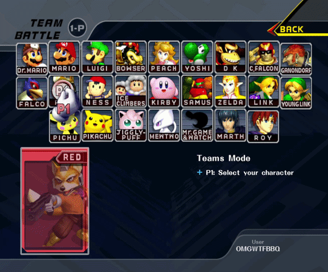

# Slippi Dolphin: Matchmaking Teams with multiple local players

## TL;DR

**[Download the Windows ZIP](https://github.com/STCDR/Ishiiruka/releases)**, extract it and run `Slippi Dolphin.exe`.

In Teams CSS, move P1's cursor into the **top-left grey corner** and press **A** to cycle **1-4 local players**. Everyone picks a character/team and presses **Start**, then enter your usual Teams room code.

First launch offers to import your Launcher Dolphin settings, controllers and account if this profile is still untouched.

## TL;DR for Slippi devs

- **Dolphin:** coordinates multiple local clients in one Melee/rollback instance, maps controller ports to assigned slots, and handles readiness, rematches and cancellation. Local EXI commands: `0xC5`-`0xC8`.
- **ASM:** simultaneous Teams CSS cursors, overlapping portraits, player-count toggle and independent Start confirmation. Local character/costume/team selections persist after matches.
- **Rust:** local-first Launcher account lookup and optional first-run profile import. Both Yes and No are remembered; custom profiles skip the prompt. The Launcher profile stays unchanged.

Existing matchmaking and remote packet formats are unchanged. Ship the paired executable, DLL and codeset together.

Source: [Dolphin](https://github.com/STCDR/Ishiiruka), [ASM](https://github.com/STCDR/slippi-ssbm-asm), [Rust](https://github.com/STCDR/slippi-rust-extensions), or the matching source ZIP.

Windows x64 preview, based on [Slippi Dolphin 3.6.4 / Ishiiruka](https://github.com/project-slippi/Ishiiruka). Currently proposes Battlefield. Original licenses and notices are retained.
